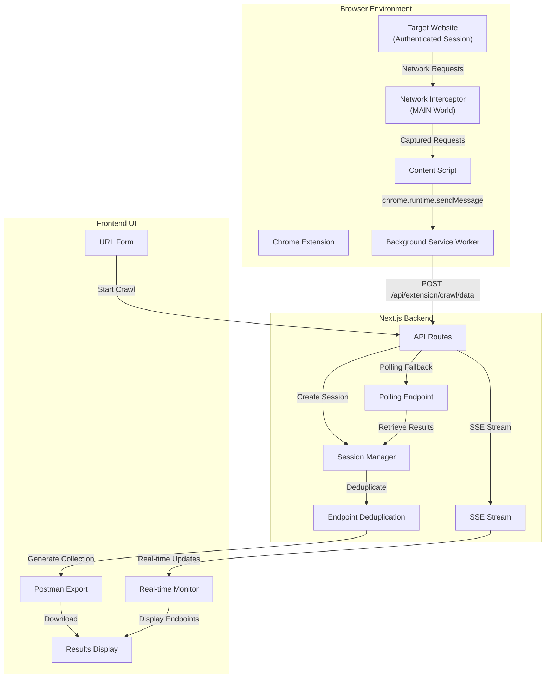

# JAEGIS - Deep-Crawler: Authenticated API Endpoint Discovery Tool

[](https://opensource.org/licenses/MIT)
[](https://nodejs.org/)
[](https://nextjs.org/)
[](https://react.dev/)
[](https://www.typescriptlang.org/)

## Overview

DeepCrawler is a powerful tool for discovering hidden API endpoints from authenticated browser sessions. It uses a Chrome extension to intercept network requests from inside the browser, capturing both visible and hidden API calls that would be impossible to discover from outside the application.

**Key Capabilities:**
- 🔐 Captures API endpoints from authenticated sessions
- 🌐 Intercepts ALL network requests (fetch, XHR, blob:, data: URLs)
- 🤖 Supports both manual and automated crawling modes
- 📊 Exports discovered endpoints as Postman collections
- ⚡ Real-time endpoint discovery with SSE streaming
- 🔄 Automatic polling fallback if connection fails

## Architecture



## Key Features

### Chrome Extension Integration
- **Network Interception**: Captures ALL network requests using fetch/XHR override in MAIN world
- **Authenticated Sessions**: Works with any website where you're logged in
- **Hidden Endpoints**: Discovers endpoints not accessible from outside the application
- **Multiple URL Types**: Supports HTTP/HTTPS, blob:, and data: URLs

### Crawl Modes

#### Manual Mode
- User manually interacts with the website (clicks, scrolls, navigates)
- Extension passively captures all network requests
- Ideal for exploring specific workflows or features
- **Inactivity Timeout**: Auto-completes crawl after 60 seconds of no new unique endpoints
- Real-time endpoint count display
- SSE stream for live updates, polling fallback if connection lost

#### Auto Mode
- Automated page interaction simulation (scrolling, clicking visible elements)
- Discovers endpoints without manual intervention
- **Inactivity Timeout**: Auto-completes crawl after 30 seconds of no new unique endpoints
- Visibility checks to avoid hidden elements
- Navigation prevention to stay on target page
- Real-time progress updates via SSE

### Inactivity Timeout Feature
- Monitors for new unique endpoints
- Countdown timer shows time until auto-completion
- Resets when new unique endpoint is discovered
- Configurable per crawl mode
- Prevents indefinite crawls while ensuring complete discovery

### Advanced URL Capture
- **HTTP/HTTPS Endpoints**: Standard API calls
- **blob: URLs**: Binary data created by `URL.createObjectURL()`
- **data: URLs**: Embedded resources like `data:image/svg+xml` or `data:image/png;base64`
- **Proper Handling**: Relative URLs and edge cases handled gracefully

### Robust Communication
- **SSE (Server-Sent Events)**: Real-time updates from backend to frontend
- **Automatic Polling Fallback**: If SSE connection fails, switches to polling
- **Session Persistence**: Graceful degradation with 410 (Gone) status for expired sessions
- **Message Delivery**: 500ms delay before stream closure to ensure message delivery

## Installation & Setup

### Prerequisites
- Node.js 18.0.0 or higher
- npm or yarn
- Chrome browser (for extension)
- Git

### Step 1: Star & Clone the Repository
Star the repository!
```bash
git clone https://github.com/usemanusai/Deep-Crawler.git
cd Deep-Crawler-main/Deep-Crawler-main
```

### Step 2: Install Dependencies
```bash
npm install
```

### Step 3: Set Up Environment Variables
```bash
cp .env.example .env.local
# Edit .env.local and add your HYPERBROWSER_API_KEY if needed
```

### Step 4: Build the Project
```bash
npm run build
```

### Step 5: Start Development Server
```bash
npm run dev
```

The server will start on `http://localhost:3002`

## Chrome Extension Setup

### Load the Extension

1. Open Chrome and navigate to `chrome://extensions/`
2. Enable "Developer mode" (toggle in top right)
3. Click "Load unpacked"
4. Select the `/extension` directory from the project
5. Verify the extension is loaded and shows as active

### Extension Files
- `manifest.json` - Extension configuration (Manifest V3)
- `background.js` - Service worker for background tasks
- `content.js` - Content script for page interaction
- `network-interceptor.js` - Network request interception in MAIN world
- `popup.html/js` - Extension popup UI
- `options.html/js` - Extension options page

## Usage Guide

### Starting a Crawl

1. **Start the dev server**:
   ```bash
   npm run dev
   ```

2. **Open the web UI**: Navigate to `http://localhost:3002`

3. **Log in to target website**: 
   - Open the target website in a new tab
   - Log in with your credentials
   - Keep the tab open

4. **Enter target URL** in the DeepCrawler UI:
   - Example: `https://miniapps.ai`
   - Example: `https://hix.ai`

5. **Select crawl mode**:
   - **Manual**: You interact with the website
   - **Auto**: Extension auto-interacts

6. **Configure inactivity timeout** (optional):
   - Manual mode default: 60 seconds
   - Auto mode default: 30 seconds

7. **Click "Start Crawl"**

### Manual Mode Workflow
1. Click "Start Crawl" with Manual mode selected
2. Extension opens target URL in new tab
3. Manually interact with the website:
   - Click buttons and links
   - Scroll through pages
   - Navigate to different sections
   - Perform actions that trigger API calls
4. Monitor real-time endpoint discovery in the UI
5. Crawl auto-completes when inactivity timeout is reached
6. Download Postman collection or copy as JSON

### Auto Mode Workflow
1. Click "Start Crawl" with Auto mode selected
2. Extension opens target URL in new tab
3. Extension automatically:
   - Scrolls the page
   - Clicks visible elements
   - Navigates to different sections
4. Monitor real-time endpoint discovery
5. Crawl auto-completes when inactivity timeout is reached
6. Download Postman collection or copy as JSON

## Technology Stack

- **Frontend**: React 19.2.0, TypeScript 5.9.2, Tailwind CSS
- **Backend**: Next.js 15.5.6 (App Router), TypeScript 5.9.2
- **Extension**: Chrome Extension Manifest V3, JavaScript
- **Communication**: Server-Sent Events (SSE), REST API
- **Build**: Next.js built-in build system

## Project Structure

```
deep-crawler-bot/
├── app/                          # Next.js App Router
│   ├── api/                      # API routes
│   │   ├── extension/            # Extension-specific endpoints
│   │   ├── crawl/                # Crawl endpoints
│   │   └── test/                 # Test endpoints
│   ├── page.tsx                  # Main UI page
│   ├── layout.tsx                # Root layout
│   └── globals.css               # Global styles
├── components/                   # React components
│   ├── UrlForm.tsx              # URL input form
│   ├── TerminalSidebar.tsx       # Real-time logs
│   ├── EndpointList.tsx          # Endpoint display
│   ├── ResultCard.tsx            # Result card
│   └── ...
├── extension/                    # Chrome Extension
│   ├── manifest.json             # Extension config
│   ├── background.js             # Service worker
│   ├── content.js                # Content script
│   ├── network-interceptor.js    # Network interception
│   └── ...
├── lib/                          # Utilities
│   ├── utils.ts                  # Helper functions
│   ├── extensionSessions.ts      # Session management
│   └── ...
├── public/                       # Static assets
├── docs/                         # Documentation
│   ├── fixes/                    # Bug fixes and solutions
│   ├── analysis/                 # Analysis and debugging
│   ├── architecture/             # Architecture docs
│   ├── testing/                  # Testing guides
│   ├── setup/                    # Setup guides
│   ├── deployment/               # Deployment docs
│   └── legacy/                   # Legacy documentation
├── __tests__/                    # Test files
├── debug-scripts/                # Debug and test scripts
├── logs/                         # Application logs
├── package.json                  # Dependencies
├── tsconfig.json                 # TypeScript config
├── next.config.js                # Next.js config
└── README.md                     # This file
```

## API Endpoints

### Extension Endpoints

**POST /api/extension/crawl**
- Initiates a crawl session
- Returns: SSE stream with real-time updates

**POST /api/extension/crawl/data**
- Receives network request data from extension
- Body: `{ requestId, endpoints: [...] }`

**GET /api/extension/crawl/results**
- Retrieves crawl results
- Query: `?requestId=<id>`

**POST /api/extension/ping**
- Health check endpoint
- Returns: `{ status: 'ok' }`

### Crawl Endpoints

**GET /api/crawl/results**
- Retrieves final crawl results
- Query: `?requestId=<id>`
- Returns: Endpoints and Postman collection

## Testing Status

✅ **Build**: Next.js 15.5.6 compiled without errors  
✅ **Dev Server**: Port 3002 responding correctly  
✅ **API Endpoints**: All endpoints responding correctly  
✅ **Manual Mode**: Tested and working  
✅ **Auto Mode**: Tested and working  
✅ **SSE Stream**: With polling fallback verified  
✅ **URL Capture**: blob: and data: URLs confirmed  

## Troubleshooting

### Extension Not Loading
1. Verify extension is in `/extension` directory
2. Check `manifest.json` is valid
3. Reload extension from `chrome://extensions/`
4. Check browser console for errors

### No Endpoints Captured
1. Verify target website is loaded in browser tab
2. Check extension is active (icon should be visible)
3. Verify you're logged in to the target website
4. Check browser DevTools console for errors
5. Try manual mode and interact with the website

### SSE Connection Lost
1. Check backend is running (`npm run dev`)
2. Verify network connectivity
3. Check browser console for error messages
4. Polling fallback should automatically activate

### Build Errors
1. Ensure Node.js version is 18.0.0 or higher
2. Delete `node_modules` and `.next` directories
3. Run `npm install` again
4. Run `npm run build`

## Contributing

Contributions are welcome! Please feel free to submit a Pull Request.

## License

This project is licensed under the MIT License - see the LICENSE file for details.

## Acknowledgments

- Maintained by: [usemanusai](https://github.com/usemanusai)
- Built with [Next.js](https://nextjs.org/), [React](https://react.dev/), and [TypeScript](https://www.typescriptlang.org/)

## Support

For issues, questions, or suggestions, please open an issue on GitHub or contact the maintainers.

---

**Last Updated**: November 11, 2025  
**Version**: 1.0.0  
**Status**: Production Ready

